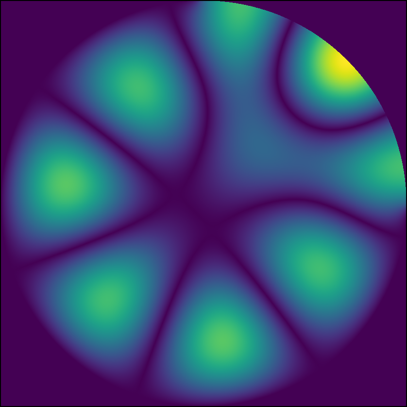

StencilStream is a SYCL-based simulation framework for iterative stencil codes, primarily targeting FPGAs. With StencilStream, application developers and domain scientists can merely write down their stencil code definition and obtain a fully functional and optimized, FPGA-accelerated application.

## Design Goals

There are many stencil acceleration frameworks available, even for FPGAs. However, many of them use customized toolchains to support domain-specific languages, which makes them both hard to use for real-world applications and hard to extend. Therefore, StencilStream uses the SYCL/oneAPI framework and C++ templates, so that it is:

* **Simple:** The first steps don't take much and one can build and verify a simple app very quickly.
* **Versatile:** Actual applications have special needs and properties, and StencilStream supports them.
* **Performant:** Domain Scientists usually aren't FPGA experts or performance engineers. With StencilStream, they don't have to be and still get highly performant applications.

## Examples

We have implemented multiple example applications. One is a simple sketch to show how to get started, one is a benchmark, and two are proper applications that use StencilStream's advanced features. They are presented in the following:

### Conway's Game of Life

Our implementation of Conway's Game of Life is found in the subfolder [examples/conway](examples/conway/). It reads in the current state of a grid from standard-in, computes a requested number of iterations, and then writes it out again.

### HotSpot

This our implementation of the HotSpot benchmark from the [Rodinia Benchmark Suite](https://rodinia.cs.virginia.edu/doku.php?id=start0), found in the subfolder [examples/hotspot](examples/hotspot/). It achieves an arithmetic throughput of more than 1 TFLOPS on a Bittware 520N accelerator using an Intel Stratic 10 X 2800 FPGA.

### FDTD 

The FDTD application in [examples/fdtd](examples/fdtd/) is used to simulate the behavior of electro-magnetic waves within micro-cavities. The computed experiment is highly configurable, using configuration files written in JSON. Computationally, it is interesting because it utilizes StencilStream's time-dependent value feature to precompute the source wave and the sub-iterations feature to alternate between a electric and a magnetic field update. Below, you find a rendering of the final magnetic field, computed for the ["Max Grid" experiment](examples/fdtd/experiments/max_grid.json):



### Convection

The convection app, found in [examples/convection](examples/convection/), simulates the convection within Earth's Mantle. It is a port of an example app for the [ParallelStencil.jl framework](https://github.com/omlins/ParallelStencil.jl) and can also be configured using a JSON file. Below, you find the animated output of the [default experiment](examples/convection/experiments/default.json).


### Performance & Hardware Usage

| **Metric** | **HotSpot (Monotile)** | **HotSpot (Tiling)** | **FDTD (Monotile)** | **FDTD (Tiling)** | **Convection (Monotile)** |
|-|-|-|-|-|-|
| Replications (Total PEs) | 280 (280) | 224 (224) | 100 (200) | 95 (190) | 8 (24) |
| Grid Size (height × width) | 720 × 1024 | 16384 × 16384 | 512 × 512 | 4608 × 4608 | 512 × 1536 |
| No. of Iterations | 280 | 1120 | 204580 | 184911 | 100 |
| Modeled Update Rate | 73.51 GCells/s | 48.23 GCells/s | 21.79 GCells/s | 14.30 GCells/s | 1.26 GCells/s | 
| Measured Update Rate | 73.40 GCells/s | 37.54 GCells/s | 21.09 GCells/s | 14.20 GCells/s | 0.83 GCells/s | 
| Throughput [GFLOPS] | 1085.97 | 563.11 | 421.80 | 284.00 | 54.78 | 
| Clock Frequency | 337.50 MHz | 317.50 MHz | 308.33 MHz | 284.38 MHz | 335.00 MHz |
| ALMs (% of 706k) | 426k (60.4%) | 481k (68.1%) | 304k (43.2%) | 444k (62.9%) | 462k (65.5%) | 
| BRAMs (% of 9094) | 3415 (37.6%) | 6025 (66.3%) | 4073 (44.8%) | 6780 (74.6%) | 2848 (31.3%) |
| DSPs (% of 4713) | 2522 (53.5%) | 2240 (47.5%) | 1725 (36.7%) | 1734 (38.8%) | 1031 (22.1%) | 

All applications were built and benchmarked at commit 5d82883fe3302f6bbf7a1adcc353ed464dd1d35e, using Intel OneAPI 23.2.0, Boost 1.81.0, and the Bittware 520N HPC board support package 20.4.0.

## Licensing & Citing

StencilStream is published under MIT license, as found in [LICENSE.md](LICENSE.md). When using StencilStream for a scientific publication, please cite the following: 

```
@inproceedings{opdenhoevel2024stencilstream,
    author = {Opdenhövel, Jan-Oliver and Alt, Christoph and Plessl, Christian and Kenter, Tobias},
    title = {StencilStream: A SYCL-based Stencil Simulation Framework Targeting FPGAs},
    booktitle = {Proc. Int. Conf. on Field Programmable Logic and Applications (FPL)},
    year = {2024}
}
```
