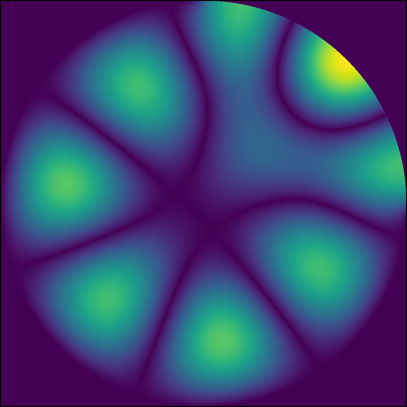
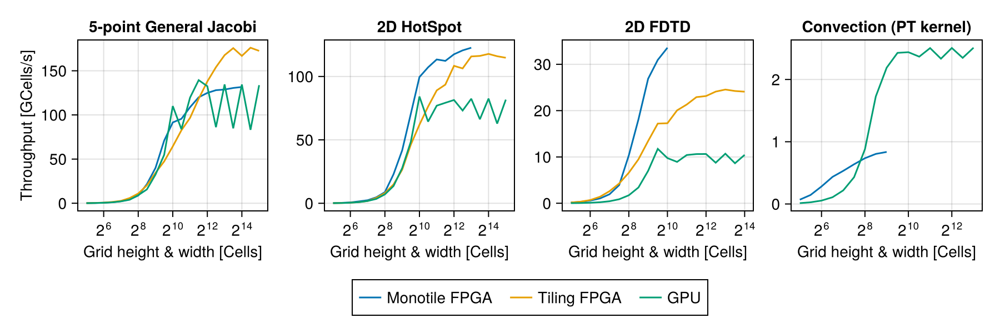

StencilStream is a SYCL-based simulation framework to accelerate iterative 2D stencil codes with heterogeneous compute accelerators. With StencilStream, application developers and domain scientists can quickly define their 2D stencil code in a straight-forward fashion and obtain a fully functional and highly performant application, utilizing the available compute accelerators.

# 🎯 Design Goals

There are many stencil acceleration frameworks available. However, many of them use customized toolchains to support domain-specific languages, which makes them both hard to use for real-world applications and hard to extend.

**StencilStream** takes a different approach. By leveraging standard **SYCL/oneAPI** and **modern C++ templates**, it offers a clean, extensible, and developer-friendly framework with three core goals:

- **🧩 Simple**  
  Get started quickly. You can build and validate a basic stencil application in just a few steps.

- **🛠️ Versatile**  
  Real-world applications have unique needs. StencilStream is designed to be flexible and adaptable to different problem domains and hardware targets.

- **🚀 Performant**  
  You don’t need to be a GPU or FPGA expert to get high performance.


# ⚙️ Hardware Platform Support

**StencilStream** is built to enable high-performance stencil computations across a diverse range of modern compute architectures. The framework abstracts away low-level hardware details, allowing developers to focus on algorithm design while targeting various platforms with minimal code changes.

To ensure portability and efficiency, StencilStream provides multiple backend implementations optimized for specific hardware. Switching between backends is as simple as linking against a different library in your CMake configuration and including a different header in your code.

StencilStream has been validated on the following accelerator classes:

## FPGAs

StencilStream was originally developed to bring high-performance computing and FPGAs closer together (see our [FPL'24 publication](https://doi.org/10.1109/FPL64840.2024.00023)). As such, StencilStream's FPGA backends are one of the most optimized backends available. The two primary FPGA backends are:

* **The Tiling backend**: The most versatile FPGA backend, which supports arbitrary grid sizes at the cost of a small performance penalty
* **The Monotile backend**: The most performant FPGA backend, which achieves the highest available throughput by limiting its support to small to medium-size grids.

In addition to this, there is also an experimental multi-FPGA version of the Monotile backend, which utilizes the networking capabilities of high-end FPGAs to scale beyond what a single FPGA can achieve.

## GPUs

With the 4.0.0 release, StencilStream also features a GPU backend that utilizes [Codeplay's oneAPI for NVIDIA GPUs plugin](https://developer.codeplay.com/products/oneapi/nvidia/home/index.html) to achieve high throughput on NVIDIA GPUs. Thanks to a transparent data layout transformation discussed in [our publication](https://doi.org/10.1145/3811257.3811259), the very same stencil code can achieve high performance both on GPUs and FPGAs.

## CPUs

StencilStream also features a fully functional CPU backend for functional evaluation. Optimizing this backend to reach the full potential of modern CPUs still is a direction for future work.

# 📖 Examples

We have implemented multiple example applications to show the capabilities of StencilStream in terms of simplicity, expressiveness, and performance. One is a simple sketch to show how to get started, two are common stencil code benchmark, and two are proper applications that use StencilStream's advanced features. They are presented in the following:

## Conway's Game of Life

Our implementation of Conway's Game of Life is found in the subfolder [examples/conway](examples/conway/). It reads in the current state of a grid from standard-in, computes a requested number of iterations, and then writes it out again.

## Jacobi

The Jacobi kernels are very common class of stencil codes commonly used for benchmarking. Our implementation contains multiple versions of it in order to scale the computational complexity of a single transition function.

## HotSpot

Our implementation of the HotSpot benchmark from the [Rodinia Benchmark Suite](https://rodinia.cs.virginia.edu/doku.php?id=start0) is found in the subfolder [examples/hotspot](examples/hotspot/). It is a very common benchmark that goes beyond the relatively simple structure of the Jacobi kernels.

## FDTD 

The FDTD application in [examples/fdtd](examples/fdtd/) is used to simulate the behavior of electro-magnetic waves within micro-cavities. The computed experiment is highly configurable, using configuration files written in JSON. Computationally, it is interesting because it utilizes StencilStream's time-dependent value feature to precompute the source wave and the sub-iterations feature to alternate between a electric and a magnetic field update. Below, you find a rendering of the final magnetic field, computed for the ["Max Grid" experiment](examples/fdtd/experiments/max_grid.json):



## Convection

The convection app, found in [examples/convection](examples/convection/), simulates the convection within Earth's Mantle. It is a port of an example app for the [ParallelStencil.jl framework](https://github.com/omlins/ParallelStencil.jl) and can also be configured using a JSON file. Below, you find the animated output of the [default experiment](examples/convection/experiments/default.json).


# 📈 Performance & FPGA Resource Usage



A thorough evaluation of each backend's performance is found in [our latest publication on StencilStream 4.0.0](https://doi.org/10.1145/3811257.3811259). As you can see in the performance plot above from this publication (Tim Stöhr et al., CC BY 4.0), all backends achieve very high throughput rates for single-device execution. The highest measured throughput is 176.08 billion cell updates per second for the Jacobi benchmark, achieved by the Tiling FPGA backend on a BittWare 520N accelerator with an Intel Stratix 10 GX 2800 FPGA, which is equivalent to 1.58 TFLOPS. In terms of arithmetic throughput, the highest measured value is 1.84 TFLOPS achieved by the Monotile FPGA backend for the HotSpot benchmark, using the same accelerator.

# 🏗️ Building and Running the Examples

## Environment Setup on Noctua 2

Most of the development of StencilStream was done on the [Noctua 2 supercomputer at the Paderborn Center for Parallel Computing](https://pc2.uni-paderborn.de/systems-and-services/noctua-2). Loading the necessary software on this system handled by one of two scripts. For building and running CPU and FPGA targets, source the following script with the base of the repository as the current working directory:

```bash
source scripts/env_fpga.sh
```

For GPU targets, source the following script:

```bash
source scripts/env_cuda.sh
```

This will load the necessary software modules and also instantiate the Julia project.

## Building

Configure the project from the repository root:

```bash
mkdir -p build && cd build
cmake -DCMAKE_BUILD_TYPE=Release ..
```

Then build a specific target:

```bash
make <target>
```

CUDA and CPU targets as well as FPGA emulation targets compile in a few minutes, but FPGA synthesis takes several hours. Also, when building the multi-FPGA examples, you have to set the `CHANNEL_MAPPING_MODE=2` environment variable to get correct results:

```bash
CHANNEL_MAPPING_MODE=2 make <target>
```

The targets corresponding to the performance table above are:

| Target | Example | Backend |
|---|---|---|
| `convection` | Convection | FPGA Monotile |
| `convection_cuda` | Convection | CUDA |
| `hotspot_cuda` | HotSpot | CUDA |
| `hotspot_mono` | HotSpot | FPGA Monotile |
| `hotspot_multi_mono` | HotSpot | FPGA Multi-FPGA Monotile |
| `hotspot_tiling` | HotSpot | FPGA Tiling |
| `fdtd_coef_device_cuda` | FDTD | CUDA |
| `fdtd_coef_device_mono` | FDTD | FPGA Monotile |
| `fdtd_coef_device_multi_mono` | FDTD | FPGA Multi-FPGA Monotile |
| `fdtd_coef_device_tiling` | FDTD | FPGA Tiling |
| `Jacobi5General_cuda` | Jacobi | CUDA |
| `Jacobi5General_mono` | Jacobi | FPGA Monotile |
| `Jacobi5General_multi_mono` | Jacobi | FPGA Multi-FPGA Monotile |
| `Jacobi5General_tiling` | Jacobi | FPGA Tiling |

Compiled binaries land in `build/examples/<example>/`.

## Benchmarking

Each example has a benchmark script at `examples/<example>/scripts/benchmark.jl`. Run it from the example directory. For Convection, HotSpot, and FDTD:

```bash
cd examples/<example>
./scripts/benchmark.jl max_perf <path-to-executable> <variant> <n_ranks>
```

`<variant>` is `mono`, `tiling`, or `cuda`. For multi-FPGA monotile targets use `multi_mono` and set `<n_ranks>` to `24`; for all other targets use `1`.

For example, to benchmark the single-FPGA HotSpot monotile binary:

```bash
cd examples/hotspot
./scripts/benchmark.jl max_perf ../../build/examples/hotspot/hotspot_mono mono 1
```

The Jacobi benchmark script reads the variant directly from the binary, so it takes one fewer argument:

```bash
cd examples/jacobi
./scripts/benchmark.jl max_perf <path-to-executable> <n_ranks>
```

Results are written to `metrics.<variant>.json` in the example directory (Jacobi writes `metrics.<executable-name>.json`).

# ⚖️ Licensing & Citing

StencilStream is published under MIT license, as found in [LICENSE.md](LICENSE.md). When using StencilStream for a scientific publication, please cite one of the following: 

```
@inproceedings{opdenhovel_stencilstream_2024,
	author = {Opdenhövel, Jan-Oliver and Alt, Christoph and Plessl, Christian and Kenter, Tobias},
	title = {{StencilStream}: {A} {SYCL}-based {Stencil} {Simulation} {Framework} {Targeting} {FPGAs}},
	booktitle = {2024 34th {International} {Conference} on {Field}-{Programmable} {Logic} and {Applications}},
  series = {FPL '24},
	year = {2024},
  location = {Turin, Italy},
  pages = {100--108},
  numpages = {9},
	url = {https://ieeexplore.ieee.org/abstract/document/10705465},
	doi = {10.1109/FPL64840.2024.00023},
  publisher = {IEEE},
  address = {New York, NY, USA}
}
@inproceedings{stoehr_gpu:2026,
	author = {Stöhr, Tim and Opdenhövel, Jan-Oliver and Plessl, Christian and Kenter, Tobias},
	title = {A {GPU} Backend for the {SYCL}-Based 2D Stencil Framework {StencilStream} and a Comparison with its {FPGA} Backends},
	booktitle = {International Workshop on OpenCL and SYCL (IWOCL '26), May 06--08, 2026, Heilbronn, Germany},
  series = {IWOCL '26},
	year = {2026},
  location = {Heilbronn, Germany},
  numpages = {12},
	doi = {10.1145/3811257.3811259},
  publisher = {ACM},
  address = {New York, NY, USA}
}
```
