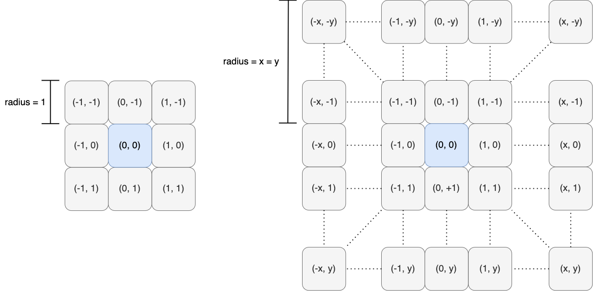
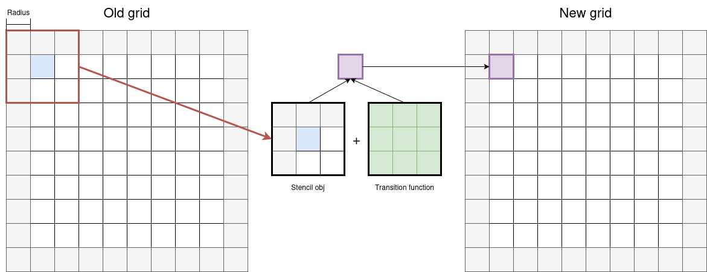

##  Basic Concepts

**StencilStream** is a flexible and extensible framework that offers developers a high degree of control when implementing stencil computations. This section introduces the fundamental concepts necessary to use the framework effectively at a higher level.  

> 💡 For in-depth definitions and detailed usage, please refer to the API reference 📚 linked at the end of each subsection.


---

###  🔀 Choosing the Right Backend

The first step when using StencilStream is selecting the matching **backend** for your target hardware. Each backend is optimized for a different architecture:

1. `monotile` – FPGA (monolithic design)
2. `tiling` – FPGA (tiled design)
3. `cpu` – x86 CPUs
4. `cuda` – NVIDIA GPUs

If you're targeting a **single backend**, you can directly include the corresponding `StencilUpdate.hpp` header:

```cpp
#include <StencilStream/"backend"/StencilUpdate.hpp>
```
Replace `"backend"` with one of the supported backend names (e.g., `cpu`, `cuda`, etc.).

---

### 🔀 Backend Selection via Compiler Flags

To enable **build-time backend selection**, you can define one of the following macros during compilation:

- `STENCILSTREAM_BACKEND_MONOTILE`
- `STENCILSTREAM_BACKEND_TILING`
- `STENCILSTREAM_BACKEND_CPU`
- `STENCILSTREAM_BACKEND_CUDA`

The following snippet shows how to include the appropriate backend implementation:

```cpp
#elif defined(STENCILSTREAM_BACKEND_MONOTILE)
    #include <StencilStream/monotile/StencilUpdate.hpp>
#elif defined(STENCILSTREAM_BACKEND_TILING)
    #include <StencilStream/tiling/StencilUpdate.hpp>
#elif ...
      ...
      ...
#endif
```

---

## 🧬 Cell

In StencilStream, the **Cell** is the fundamental unit of computation. It defines the data layout for each point in your stencil grid.

One of the core strengths of StencilStream is that it **does not impose limitations on the cell’s data type or structure**. You have full flexibility to define a `Cell` that best suits your simulation.


### Simple Cell Types

The most basic `Cell` can be a single primitive type. For example, a boolean cell:

```cpp
bool cell;
```

You can also use other fundamental types such as int, float, or double:

```cpp
int cell;
float cell;
double cell;
```

### Vector-Based Cells

For more advanced use cases, you can use vector types. Here's an example of a cell with two floating-point values:

```cpp
vec<float, 2> cell;
```

This is useful when each cell holds multiple related values (e.g., temperature and heat flow).

### Struct-Based Cells

StencilStream also allows you to define complex Cell types using structs, combining different data types:

```cpp
struct Cell {
    bool a, b;
    int c, d;
    float e, f;
    double g, h;
};
```

This approach gives you maximum flexibility and is especially useful for simulations involving mixed-precision or multi-field data.

> 💡 Choose your Cell type based on the needs of your simulation—simple types for performance, complex structs for flexibility.

---
## <i class="fas fa-chess-board"></i> Grid

A **Grid** in StencilStream is a 2D container that holds your simulation state. Each element in the grid is a `Cell`, and the type of that cell is user-defined.

Currently, grids are strictly **2-dimensional**, defined along the `x` and `y` axes.

> ⚠️ Each grid can store **only one cell type**.  
> To simulate heterogeneous data, you should combine multiple fields into a single `struct` cell.

### Creating a Grid

Grids are created using the **Grid constructor**, which takes the dimensions and cell type as parameters. For example:


```cpp
Grid<CellType> grid(width, height);
```

To interact with the grid’s contents, you’ll use a grid accessor, which provides a clean interface to read and write cell data in a stencil computation.

### 📚 Learn More

- See the [API Reference](../html/conceptstencil_1_1concepts_1_1Grid.html).
- Explore real-world examples in the [Samples Section](#) to see how grids are initialized and used in practice.

---

## 🔄 Transition Function

The **transition function** is the core of any stencil computation in StencilStream. It defines how each cell in the grid evolves based on its current state and the states of its neighbors.

Before implementing one, its important to understand how the **stencil object** works and how it is passed to the transition function.

### What is a Stencil Object?

A **stencil object** is a small window over the grid. It includes the **central cell** (at coordinate `0,0`) and its **neighboring cells**, based on a given **stencil radius**.  Neighboring cells are accessed with relative offsets, such as `(-1, 0)` for the left neighbor or `(1, 1)` for the bottom-right neighbor.

> 🔹 The central cell is always at position `(0, 0)` in the stencil.  
> ⚙️ The radius can be set by the user and determines how many neighbors in each direction are included.



*Figure 1: Coordinates in the stencil object passed to the transition function. The central cell (blue) and its neighbors (gray) in a 2D stencil.*


### How the Transition Function Works

The **transition function** is invoked for each cell in the grid. It receives a **stencil object** as input, which includes the current cell (at position `(0, 0)`) and its neighbors. The function then computes and returns the **new cell value** based on the stencil's contents.

This process is illustrated below:

  
*Figure 2: Stencil-based computation: from input grid to output grid via the transition function.*

Inside the transition function, the actual logic or computation is defined which is applied to each stencil. This is where simulation-specific behavior is implemented.

> ✅ The return value of the transition function **must match the  defined Cell type in the transition function**.

### 📚 Learn More

- See the [API Reference](../html/conceptstencil_1_1concepts_1_1TransitionFunction.html).
- Explore real-world examples in the [Samples Section](#) to see how .... .

---

## Definition of Variables

StencilStream offers several variables to configure your simulation. Below is a list of the most important ones, along with their purpose and usage.

**`device`**  
:  Specifies the target compute device. Used in the `StencilUpdater` constructor to select the hardware (e.g., CPU, GPU, FPGA) that will run the transition function.

**`stencil_radius`**  
:  Defines the radius of the stencil used in the transition function. A radius of 1 means the stencil includes all direct neighbors (top, bottom, left, right, and diagonals) around the central cell.

**`n_iterations`**  
:  Sets the number of simulation steps (iterations) to compute. The resulting output grid will contain data up to:  
`iteration_offset + n_iterations`.

**`iteration_offset`**  
:  Defines the starting iteration index of the input grid. Useful for simulations that are run in chunks or resume from previous states.

**`halo_value`**  
:  Specifies the value assigned to **out-of-bounds** cells. These are virtual cells outside the actual grid boundaries, used during stencil computation near edges.

**`TimeDependentValue`**  
:  ???