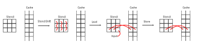
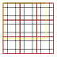

# Architecture {#Architecture}

## Terminology {#terminology}

First, we have to lay down some terminology used in StencilStream:

| Word | Definition |
|------|------------|
| static | defined at compile time, part of the design |
| dynamic | defined at runtime, part of the payload data |
| Cell | Fundamental element of StencilStream's architecture. Its type is user-provided and every cell has a value of this type. |
| Grid | A rectangular container of cells with a dynamic, arbitrary size |
| Grid width/height | The dynamic number of columns/rows in a grid |
| Stencil | A quadratic container with a central cell and all cells at a [Chebyshev distance](https://en.wikipedia.org/wiki/Chebyshev_distance) up to the stencil radius ([extended Moore neighborhood](https://en.wikipedia.org/wiki/Moore_neighborhood)) |
| Stencil radius | The static, maximal Chebyshev distance of cells in a stencil to the central cell |
| Stencil diameter | `2 * stencil_radius + 1`, the width and height of the stencil |
| Tile | A rectangular container of cells with a static size |
| Tile width/height | The number of columns/rows in a tile |
| Transition function | A function that maps a stencil (and additional information) to the next iteration of the stencil's central cell |
| Tile Halo | Additional cells that are added to a tile to form an input tile |
| Grid Halo | Cells outside of the user-defined grid |

## Indexing and Iteration order {#indexingorder}

Rectangular containers in StencilStream are always organized in columns and rows. The first index is always the column index and the second index is always the row index. The origin is thought to be in the north-western corner. An example where every grid cell contains it's index:

```
                       North
     -----------------------------------------
     | (0,0) | (1,0) | (2,0) | (3,0) | (4,0) |
     -----------------------------------------
     | (0,1) | (1,1) | (2,1) | (3,1) | (4,1) |
     -----------------------------------------
West | (0,2) | (1,2) | (2,2) | (3,2) | (4,2) | East
     -----------------------------------------
     | (0,3) | (1,3) | (2,3) | (3,3) | (4,3) |
     -----------------------------------------
     | (0,4) | (1,4) | (2,4) | (3,4) | (4,4) |
     -----------------------------------------
                       South
```

Iteration over rectangular containers in StencilStream is always column wise, meaning that the row index is moving the fastest. An example of a for loop that iterates over a Grid with `grid_width` columns and `grid_height` rows:

```
for (uindex_t c = 0; c < grid_width; c++)
{
    for (uindex_t r = 0; r < grid_height; r++)
    {
        grid[c][r] = ID(c, r);
    }
}
```

## Tile-wise computation {#tilecomputation}

The general goal of a stencil execution engine like StencilStream is to calculate a certain iteration of a grid of cells where a single iteration step of a single cell is computed from cell's neighborhood (contained in the stencil). This is repeated iteratively over all cells of the grid and for all iterations up to the desired iteration.

However, the naive approach of storing all cells in a buffer and reading the neihborhood directly from this buffer doesn't work well for FPGAs. StencilStream therefore uses two different architectures inspired by [Hamid Reza Zohouri, Artur Podobas and Satoshi Matsuoka](https://dl.acm.org/doi/pdf/10.1145/3174243.3174248) that usetemporal caching and in one case spatially tiled buffers to perform the computations.

Let's look at the simplest case first: There is a tile and we want to calculate the it's next iteration. StencilStream splits up this task into an input kernel, an execution kernel and an output kernel. They communicate via on-chip FIFO pipe and the input kernel receives access to the current iteration of the tile while the output kernel receives access to buffers for the next iteration of the tile. The input kernel reads the cells from the buffer column-wise (as discussed in ["Indexing and Iteration order"](#index)) and sends them to the execution kernel.

The execution kernel has an internal stencil buffer stored in registers and a cache stored in on-chip block memory. This cache has a width of `stencil_diameter - 1` and is as high as the input buffer. When a new cell arrives from the input kernel, every cell in the stencil buffer is shifted to the north once and the new cell is placed in the south-eastern corner of the stencil buffer. The rest of the southern-most row is filled with cells from the cache. Then, the row in the cache is overridden with all the cells in southern-most row of the stencil buffer, except for the western-most cell in this row. In effect, this means that all cells in this row of the cache are shifted west once and the eastern-most cell in this row is set to the input. The following figure illustrates this:



After these shifts, the stencil buffer contains the correct neighborhood of a central cell. Then, the transition function is executed and the result is sent to the output kernel. The row counter is increased and the next input is read.

Of course, the input and output of an execution stage do not necessarily have to come from the input or output kernel. StencilStream arranges multiple execution stages into a pipeline. This means that for a given pipeline length of `p`, the grid is only written to global memory every `p` iterations and since the main loop of the execution kernel is pipelined itself, all of these `p` iterations are calculated in parallel, utilizing the full potential of the FPGA. This long stream of values is also where the name "StencilStream" comes from.

## Grid Tiling {#tiling}

Per definition, the range of tiles is static and the range of grids is dynamic. This means that the range of a grid may exceed the range of a tile. StencilStream therefore partitions the grid into tiles and computes the next iterations tile by tile. In order to calculate the next iteration of a cell, you need it's neighborhood. For most cells in a tile, this neighborhood is included in the tile, but not for those on the edge of the tile. This means that in order to calculate the next iteration of a tile, cells from neighboring tiles are needed too. These cells are known as the halo of a tile. Since more cells are needed in the halo for every iteration that is computed, the input tile has to contain `stencil_radius` additional cells in every cardinal direction. This leads us to an input tile with `tile_width + 2 * stencil_radius * pipeline_lenth` columns and `tile_height + 2 * stencil_radius * pipeline_length` rows.

In order to allow easy access to a tile's halo, tiles are partitioned into buffers too. Every tile has four corner buffers, four edge buffers and a core buffer. The following figure illustrates the final partition of a grid, where the buffer borders are marked in black, tile borders are marked in red and the grid border is marked in yellow. Note that the shapes of the tiles and their buffers is static, but the number of tiles is dynamic and adapted to contain the whole grid.



The resulting input for a submission of the execution kernel is therefore partitioned into 5x5 buffers and the output is partitioned into 3x3 buffers. The IO code used by StencilStream groups these buffers into buffer columns (five buffer columns for the input and three for the output) and submits the input/output kernel for every single column. Therefore, every invocation has access to a number of full cell columns from the input or output which it can process. Also note that the height of the buffers is equal for every buffer column, which is therefore used as a constant parameter of the design.

### Halo/Edge handling {#halo}

The last missing concept is StencilStream's grid halo handling. As one can see in the figure above, there are no neighboring cells for all cells of the grid: There are no further cells at the northern and western edge of the grid and there are additional cells east and south of the grid. These cells belong to the grid halo and their value depends on the transition function in use. Some transition functions can simply leave those cells undefined and ignore them, some can use a default value and some might require something different.

StencilStream currently only supports transition functions with a default value, which is a superset of those that ignore missing cells. This default value, also known as halo value, is set in the `StencilExecutor` and StencilStream guarantees that this halo value will be present whenever a cell outside of a grid is accessed.

### Burst-aligned buffers {#burstalignment}

One last concept of note is the layout of the buffers themselves: The global memory interface of most FPGAs support burst accesses where a specific number of bytes can be read or written in one transaction. Therefore, those interfaces are most efficient when all memory accesses are organized in such bursts. StencilStream ensures this by using two-dimensional buffers with the "height" of one memory burst.

## The Monotile Architecture {#monotile}

The architecture and buffer layout described above introduces complex grid partitioning in order to work on grids with arbitrary ranges. However, there are applications where the possible grid ranges are known at compilation time and where the biggest grid may fit on the FPGA as a single tile. Grid tiling is unnecessary in this case and StencilStream offers an executor without it: The \ref stencil::MonotileExecutor. As the name indicates, the monotile executor stores the grid in a single buffer and computes the next iterations of the whole grid in one kernel invocation.

This approach uses less FPGA resources than the tiling architecture for the same tile range and pipeline length since the IO kernels are simpler and the caches are smaller. The monotile execution kernel also has a lower latency and runtime than the tiled execution kernel since less main loop iterations are required. However, the runtime does not scale well for varying grid ranges. Both of StencilStreams's execution kernels use the same amount time for every invocation, regardless whether most of the tile cells are within the grid or not. Therefore, the runtime of the tiled architecture with many small tiles actually scales with the grid range, while the monotile architecture with a single big tile does not.